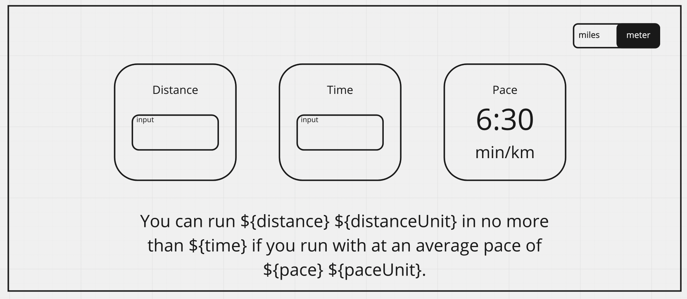

# Running Pace Calculator

This project will be about building a calculator that can determine the pace that a runner needs to achieve in order to complete a certain distance in a specific time.

The first step will be to have a distance and time set by the user and calculate and show the resulting pace.

BONUS: implementing a switch to be able to go from metric unit to imperial for the user.

IMPROVEMENTS:

1. Allow the user ibcwubvpw9ub to modify time or distance with a cursor or a text entry after the first computation
2. Allow to actually set the pace and time and then compute the distance, or the pace and time and then compute the time, etc..
3. many many more ideas to come ;)
4. just adding this to see the new git save
5. Now let's do this modification again
6. a new change
7. this is only for the new branch

Here is an idea of how the UI could look like:

